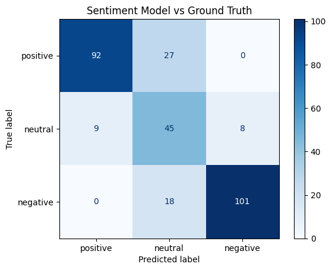

# employee_sentiment_analysis
Open-ended survey responses contain the richest qualitative signal in any employee dataset, but hand-coding thousands of responses is prohibitively slow. In my networking calls with People Analytics folks, this is a consistent problem across teams. Similiarly, when I ask how people think AI will shape the industry, the number one response is interest in using LLMs to quickly process open-ended survey response questions to generate insights. 

This repo creates dummy employee response data to test whether an open-source LLM can be used "out of the box" to automate coding of open-ended responses for employee insights. 

**generate_employee_survey_data.py** is a script I had Claude make so I could generate dummy employee data. It provides a column of "ground truth" so I can compare the LLM model outputs. 

**employee_analysis.ipynb** shows how I performed a Sentiment Analysis using HuggingFace. I used a pre-trained LLM to see how it would perform on my dataset of 300 comments. 

## Insights and Take Away 
The overall model accuracy was **79%**. The model did a better job classifying positive and negative than it did neutral. This is expected. 

Importantly, the precision score was better than recall for both positive and negative labels. This means, that when the model flags something as either positive or negative, it is right over 90% of the time. This is a signal we can trust and leadership would feel confident spending time following up with those flags. 

Accuracy: 0.793

Classification Report:
              precision    recall  f1-score   support

    positive       0.91      0.77      0.84       119
     neutral       0.50      0.73      0.59        62
    negative       0.93      0.85      0.89       119

    accuracy                           0.79       300
   macro avg       0.78      0.78      0.77       300
weighted avg       0.83      0.79      0.81       300

**Take Away**: Open source LLMs can be used out-of-the-box to code sentiment on open-ended employee responses. This entire project took about half a day of work to complete - this type of analysis can be implemented very quickly. The next step from here would be to explore whether sentiment varys by department or job level. Are all the positive comments coming from Fiance and all the negative ones are coming from Marketing? Using this data in conjunction with people data will lead to richer and higher quality insights. 

